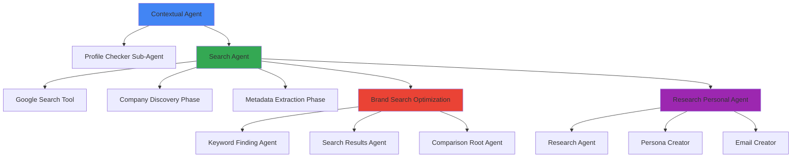

# 🤖 AI Agent Orchestration Platform - Google Hackathon 2025

A sophisticated multi-agent AI system built with **Google Agent Development Kit (ADK)** and **Google Cloud Platform** for intelligent lead generation, brand optimization, and personalized research automation.

## 🎯 Project Overview

This platform demonstrates the power of **Google ADK's multi-agent orchestration** through specialized AI systems that work together to solve complex business challenges. Each agent leverages Google Cloud services including **Google Search API** and **Gemini models** to deliver intelligent automation.

## 🏗️ Architecture

The platform consists of **4 primary agents** with **6 specialized sub-agents** orchestrated through Google ADK:



## ✨ Core Agents & Orchestration

### 🎯 Contextual Agent (Lead Profiling System)
**Primary Function**: Interactive client profile building through conversational AI

**Sub-Agents**:
- **Profile Checker Agent**: Validates profile completeness using structured validation
- **Search Agent Integration**: Seamlessly hands off to search agent via Google Cloud Run

**Google ADK Features**:
- Multi-phase conversation management
- State persistence across interactions
- Tool orchestration for profile updates
- Cross-service communication via HTTP/A2A protocol

**Tools & Integration**:
```python
tools=[update_client_profile, present_client_profile]
sub_agents=[profile_checker_agent]
model="gemini-2.5-pro"
```

### 🔍 Search Agent (Lead Discovery Engine)
**Primary Function**: Intelligent company discovery using Google Search API

**Core Workflow**:
1. **Phase 1**: Company Discovery using Google Search tool
2. **Phase 2**: Detailed metadata extraction with multiple search queries

**Google Cloud Integration**:
- Deployed on **Google Cloud Run** for scalability
- Uses **Google Search API** for all data gathering
- Enforces mandatory search tool usage for accuracy

**Orchestration Pattern**:
```python
# Automatic two-phase execution
search_agent = LlmAgent(
    model="gemini-2.5-pro",
    tools=[google_search],
    instruction="MANDATORY: Use google_search tool for ALL information"
)
```

### 🎨 Brand Search Optimization Agent
**Primary Function**: Brand search optimization and competitive analysis

**Sub-Agent Architecture**:
- **Keyword Finding Agent**: Brand keyword analysis and optimization
- **Search Results Agent**: Search result analysis and recommendations
- **Comparison Root Agent**: Competitive comparison analysis

**Google ADK Integration**:
- Multi-agent coordination for brand analysis
- Structured workflow orchestration
- Gemini-powered analysis and insights

### 📊 Research Personal Agent (Sequential Pipeline)
**Primary Function**: Company research and personalized email generation

**Sequential Agent Pattern**:
Uses Google ADK's `SequentialAgent` for dependent workflow execution:

1. **Research Agent**: Company intelligence gathering and analysis
2. **Persona Creator**: AI-driven buyer persona generation
3. **Email Creator**: Personalized outreach content creation

**Pipeline Architecture**:
```python
root_agent = SequentialAgent(
    name="pipeline_agent",
    sub_agents=[research_agent, persona_creator, email_creator],
    description="Sequential execution pipeline for research → persona → email"
)
```

## 🛠️ Google Technology Stack

### Core Platform
- **Google Agent Development Kit (ADK)**: Multi-agent orchestration and tool management
- **Gemini 2.5 Pro/Flash**: Primary LLM for all agents
- **Google Cloud Run**: Scalable agent deployment
- **Google Search API**: Real-time web search capabilities

### Development Framework
- **Python 3.9+** with Google ADK
- **Google Cloud SDK** for deployment
- **A2A Protocol** for agent-to-agent communication
- **FastAPI** with Google ADK integration

### Data & Storage
- **Google Cloud Storage**: Artifacts and document storage
- **Structured JSON**: Agent state management
- **Session persistence**: Cross-agent communication state

## 📋 Prerequisites

### Google Cloud Setup
```bash
# Install Google Cloud SDK
curl https://sdk.cloud.google.com | bash

# Authenticate
gcloud auth login
gcloud config set project YOUR_PROJECT_ID

# Enable required APIs
gcloud services enable run.googleapis.com
gcloud services enable aiplatform.googleapis.com
```

### API Keys Required
- **Google API Key** (for Gemini models)
- **Google Search API Key**
- **Google Cloud Project ID**

## 🚀 Quick Start

### 1. Environment Setup

```bash
git clone <repository-url>
cd googlehack25
```

Create `.env` file:
```env
# Google Cloud Configuration
GOOGLE_API_KEY=your_google_api_key_here
GOOGLE_CLOUD_PROJECT=your_gcp_project_id_here
GOOGLE_CLOUD_LOCATION=eu-north-1

# Search Configuration
GOOGLE_SEARCH_API_KEY=your_search_api_key_here

# Model Configuration
MODEL=gemini-2.5-pro
```

### 2. Install Dependencies

```bash
# Install Google ADK and dependencies
pip install google-adk==1.13.0
pip install -r contextual_agent/requirements.txt
pip install -r search_agent/requirements.txt

# Additional tools
pip install selenium pillow
```

### 3. Deploy Agents

#### Local Development
```bash
# Run contextual agent
cd contextual_agent
python -m contextual_agent --host 0.0.0.0 --port 8080

# Run search agent
cd search_agent
python -m search_agent --host 0.0.0.0 --port 8081
```

#### Google Cloud Run Deployment
```bash
# Deploy search agent to Cloud Run
adk deploy cloud_run \
--project=$GOOGLE_CLOUD_PROJECT \
--region=$GOOGLE_CLOUD_LOCATION \
--service_name=search-agent \
--app_name=search_agent \
--with_ui \
./search_agent

# Deploy contextual agent
adk deploy cloud_run \
--project=$GOOGLE_CLOUD_PROJECT \
--region=$GOOGLE_CLOUD_LOCATION \
--service_name=contextual-agent \
--app_name=contextual_agent \
--with_ui \
./contextual_agent
```

## 🔧 Agent Interaction Patterns

### Cross-Agent Communication
The platform demonstrates advanced agent orchestration patterns:

**1. HTTP/A2A Protocol Communication**:
```python
# Contextual Agent → Search Agent via Cloud Run
def send_to_search_agent(profile_data: Dict[str, Any]) -> Dict[str, Any]:
    base_url = "https://search-678974019191.europe-north1.run.app"
    response = requests.post(f"{base_url}/run_sse", json=payload)
```

**2. Sequential Pipeline Execution**:
```python
# Research pipeline with dependent steps
SequentialAgent(sub_agents=[research_agent, persona_creator, email_creator])
```

**3. Hierarchical Sub-Agent Delegation**:
```python
# Brand optimization with specialized sub-agents
Agent(sub_agents=[keyword_finding_agent, search_results_agent, comparison_root_agent])
```

### Tool Orchestration Examples

**Profile State Management**:
```python
def update_client_profile(
    service_provided: Optional[str] = None,
    unique_value_prop: Optional[str] = None,
    industry_niche: Optional[str] = None,
    # ... other profile fields
) -> Dict[str, Any]:
    # Update global profile state
    return profile
```

**Google Search Tool Usage**:
```python
# Mandatory search verification
search_agent = LlmAgent(
    tools=[google_search],
    instruction="MANDATORY: Use google_search tool for ALL information gathering"
)
```

## 📊 Data Flow & State Management

### Agent State Persistence
```python
# Global profile state management
client_profile: Dict[str, Any] = {
    "user_info": {
        "service_provided": "",
        "unique_value_prop": "",
        "core_messaging": {...}
    },
    "ideal_client": {
        "company_profile": {...},
        "opportunity_signals": {...}
    }
}
```

### Analytics & Monitoring
- **Lead tracking**: Company discovery metrics
- **Conversion analytics**: Profile completion rates  
- **Performance monitoring**: Agent response times
- **Search optimization**: Query effectiveness analysis

## 🎮 Usage Examples

### 1. Client Profile Building
```bash
# Start contextual agent
python -m contextual_agent

# Interactive conversation flow:
# Phase 1: Business understanding
# Phase 2: Core messaging definition  
# Phase 3: Ideal client identification
# Phase 4: Buying signals brainstorming
# Phase 5: Final profile validation
```

### 2. Brand Search Optimization
```python
# Analyze brand presence
brand_agent.analyze_brand("Nike")

# Outputs:
# - Keyword analysis and recommendations
# - Competitor comparison analysis
# - Search result optimization insights
```

### 3. Research Pipeline
```python
# Sequential research execution
research_pipeline.execute("Acme Corporation")

# Pipeline stages:
# 1. Company research and analysis
# 2. Persona generation
# 3. Personalized email creation
```
---

**🏆 Built for Google Hackathon 2025 - Showcasing the power of Google ADK multi-agent orchestration with Google Cloud Platform integration**